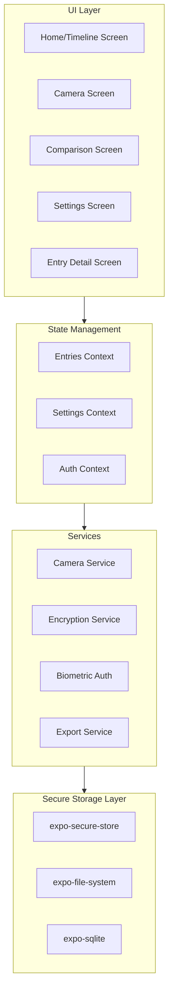
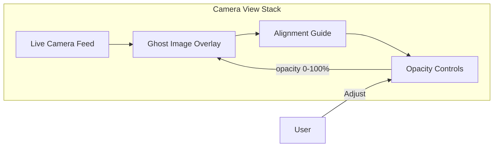

# BodyTrace - React Native Expo App Plan

## Architecture Overview



## Tech Stack

| Layer        | Technology                   |
| ------------ | ---------------------------- |
| Framework    | React Native + Expo SDK 52   |
| Language     | TypeScript                   |
| Navigation   | Expo Router (file-based)     |
| Styling      | NativeWind v4 (Tailwind CSS) |
| Icons        | Lucide React Native          |
| State        | React Context + useReducer   |
| Database     | expo-sqlite (encrypted)      |
| Camera       | expo-camera                  |
| Auth         | expo-local-authentication    |
| File Storage | expo-file-system             |

## Project Structure

```
bodytrace/
├── app/                          # Expo Router screens
│   ├── (tabs)/
│   │   ├── _layout.tsx           # Tab navigation layout
│   │   ├── index.tsx             # Home/Timeline screen
│   │   ├── camera.tsx            # Camera with overlay
│   │   ├── compare.tsx           # Comparison tool
│   │   └── settings.tsx          # Settings screen
│   ├── entry/
│   │   └── [id].tsx              # Entry detail view
│   ├── _layout.tsx               # Root layout (auth gate)
│   └── lock.tsx                  # Biometric lock screen
├── components/
│   ├── camera/
│   │   ├── GhostOverlay.tsx      # Semi-transparent overlay
│   │   ├── AlignmentGuide.tsx    # Pose alignment grid
│   │   └── OpacitySlider.tsx     # Overlay opacity control
│   ├── timeline/
│   │   ├── TimelineEntry.tsx     # Single entry card
│   │   └── TimelineList.tsx      # Scrollable timeline
│   ├── comparison/
│   │   ├── SideBySide.tsx        # Side-by-side view
│   │   └── SliderOverlay.tsx     # Before/after slider
│   └── ui/
│       ├── Button.tsx
│       ├── Card.tsx
│       └── Modal.tsx
├── contexts/
│   ├── EntriesContext.tsx        # Entries state
│   ├── SettingsContext.tsx       # App settings
│   └── AuthContext.tsx           # Auth state
├── services/
│   ├── database.ts               # SQLite operations
│   ├── encryption.ts             # File encryption
│   ├── biometric.ts              # Biometric auth
│   └── export.ts                 # Image export
├── hooks/
│   ├── useCamera.ts              # Camera logic
│   ├── useEntries.ts             # Entry CRUD
│   └── useSecureStorage.ts       # Encrypted storage
├── types/
│   └── index.ts                  # TypeScript types
└── utils/
    └── constants.ts              # App constants
```

## Data Models

```typescript
// types/index.ts
interface Entry {
  id: string
  createdAt: Date
  photos: {
    front: string // encrypted file path
    side: string
    back: string
  }
  measurements: {
    neck?: number
    chest?: number
    waist?: number
    hips?: number
    leftArm?: number
    rightArm?: number
    leftThigh?: number
    rightThigh?: number
    weight?: number
  }
  notes?: string
}

interface Settings {
  frequency: "weekly" | "monthly"
  reminderEnabled: boolean
  reminderDay: number
  biometricEnabled: boolean
}
```

## Camera Overlay Implementation (Core Feature)

The ghost overlay camera combines a live camera preview with a semi-transparent previous photo:



**Implementation approach:**

1. Use `expo-camera` for the live feed as the base layer
2. Overlay an `<Image>` component with `position: absolute` and adjustable opacity
3. Add alignment guides (grid lines, silhouette outline)
4. Provide a slider to adjust ghost opacity (0% - 50% recommended)
5. Store the reference photo path in state when user selects a comparison photo

```tsx
// Simplified overlay structure
<View style={{ flex: 1 }}>
  <CameraView style={StyleSheet.absoluteFill} />

  {ghostImage && (
    <Image
      source={{ uri: ghostImage }}
      style={[StyleSheet.absoluteFill, { opacity: ghostOpacity }]}
      resizeMode="cover"
    />
  )}

  <AlignmentGuide />
  <OpacitySlider value={ghostOpacity} onChange={setGhostOpacity} />
</View>
```

## Database Schema (SQLite)

```sql
CREATE TABLE entries (
  id TEXT PRIMARY KEY,
  created_at INTEGER NOT NULL,
  photo_front TEXT,
  photo_side TEXT,
  photo_back TEXT,
  measurements TEXT,  -- JSON blob
  notes TEXT
);

CREATE TABLE settings (
  key TEXT PRIMARY KEY,
  value TEXT
);
```

## Security Architecture

1. **Biometric Gate**: App requires Face ID/Touch ID on launch via `expo-local-authentication`
2. **Encrypted Photos**: Images stored with AES-256 encryption using a device-derived key
3. **Secure Metadata**: Sensitive data in `expo-secure-store` (keychain/keystore backed)
4. **No Cloud Sync**: All data remains on-device only

## Implementation Order

### Phase 1: Project Setup

- Initialize Expo project with TypeScript
- Configure NativeWind
- Set up Expo Router navigation structure
- Create base UI components

### Phase 2: Home Screen / Timeline

- Implement `EntriesContext` with mock data
- Build `TimelineList` and `TimelineEntry` components
- Create the Home screen layout

### Phase 3: Camera Overlay (Core Feature)

- Set up `expo-camera` with permissions
- Implement `GhostOverlay` component
- Add `AlignmentGuide` and `OpacitySlider`
- Build the full camera capture flow

### Phase 4: Entry Workflow

- Create measurement input form
- Implement photo capture sequence (Front → Side → Back)
- Wire up entry creation and storage

### Phase 5: Storage and Security

- Set up SQLite database
- Implement file encryption for photos
- Add biometric authentication gate

### Phase 6: Comparison Tool

- Build side-by-side comparison view
- Implement interactive slider overlay
- Create export functionality

## Key Dependencies

```json
{
  "expo": "~52.0.0",
  "expo-camera": "~16.0.0",
  "expo-file-system": "~18.0.0",
  "expo-secure-store": "~14.0.0",
  "expo-sqlite": "~15.0.0",
  "expo-local-authentication": "~15.0.0",
  "expo-image-manipulator": "~13.0.0",
  "nativewind": "^4.0.0",
  "lucide-react-native": "^0.300.0",
  "react-native-reanimated": "~3.16.0",
  "react-native-gesture-handler": "~2.20.0"
}
```

## Notes

- **Why Expo Router over React Navigation?** File-based routing is simpler and Expo SDK 52 has excellent support. Deep linking comes free.
- **Why Context over TanStack Query?** The app is offline-first with no API calls. Context + useReducer is sufficient and adds no extra dependencies.
- **Why SQLite over AsyncStorage?** Structured queries for timeline filtering, better performance with many entries, and encryption support.
